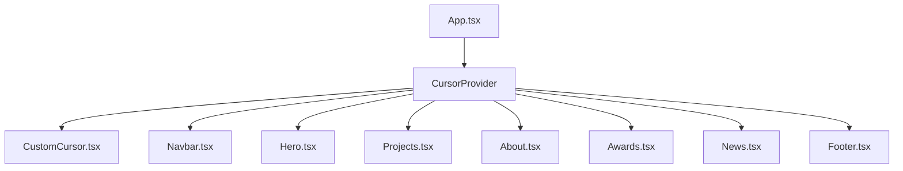

# 🪐 Nexus Design - Premium Cinematic Creative Agency Website

Nexus Design is a high-end, premium portfolio website built for a digital design and industrial engineering concept agency. The website features state-of-the-art cinematic transitions, interactive mouse-following physics, and immersive layouts designed to wow visitors at first glance.

---

## 🎨 Project Concept & Subject

**Nexus Design** operates at the intersection of digital excellence and physical hardware execution. The website showcases a forward-thinking portfolio of advanced engineering projects:
* **Future Delivery Pizza Pod:** A modular, high-efficiency autonomous delivery platform.
* **Hydrogen Energy Storage System:** A zero-emission, solid-state green energy storage unit.
* **Autonomous Security Vehicle:** An AI-driven surveillance concepts equipped with LiDAR and computer vision.
* **Drivable eVTOL Flying Car:** A futuristic personal transportation aircraft concept.

---

## 🚀 Key User Interactions & Features

* **Cinematic Custom Cursor:** A physical, fluid spring follower cursor that reacts dynamically by scaling up or color-inverting when hovering over interactive elements.
* **Floating 3D Sculpture Parallax:** A central fluid metallic sculpture that tracks mouse coordinates, floating and tilting responsively in 2D space.
* **Interactive Project Accordion:** An expandable vertical list layout that reveals high-fidelity concept designs and changes background scenes reactively on hover or touch.
* **Latest News Hover Portal:** Circular thumbnail previews that pop up and lag-follow the cursor as users hover over article rows.
* **Magnetic Footer Button:** A massive circular contact button that uses spring dampening to magnetically pull itself towards the mouse cursor.
* **Responsive Navigation Overlay:** A custom hamburger button that morphs into an "X" and triggers a staggered, full-screen menu overlay on tablet/mobile screens.

---

## 🛠️ Tech Stack & Software Architecture

### Core Technologies
* **Framework:** React 19 + TypeScript
* **Build Tool:** Vite (configured with fast Hot Module Replacement)
* **Animation Engine:** Framer Motion (spring physics, custom layout morphs, and `AnimatePresence` exit control)
* **Icons:** Lucide React
* **Hosting/Server Environment:** Node.js (served locally on production preview via static serve)

### Styling System
* **CSS System:** Vanilla CSS token architecture (`src/index.css`)
* **Responsive Scaling:** Built using responsive fluid typography variables (`clamp()`) to automatically scale headers and copy across screen sizes.
* **Accessibility-First Layers:** All interactive elements use semantic HTML structure (anchors, sections, buttons) with descriptive `aria-label` properties.

---

## 📐 Component Structure & Layout

The project follows a modular React component structure under `src/`:



* **[App.tsx](file:///c:/Users/mutlu/Desktop/NEXUSDESIGN/src/App.tsx):** Root layout that mounts all sections inside the global cursor context.
* **[Navbar.tsx](file:///c:/Users/mutlu/Desktop/NEXUSDESIGN/src/components/Navbar.tsx):** Handles sticky menu state, hamburger animations, and fullscreen responsive drawer overlay.
* **[CustomCursor.tsx](file:///c:/Users/mutlu/Desktop/NEXUSDESIGN/src/components/CustomCursor.tsx):** Manages mouse-tracking coordinates and uses media queries to auto-disable itself on touch-screen devices (< 1024px) to prevent pointer conflicts.
* **[Hero.tsx](file:///c:/Users/mutlu/Desktop/NEXUSDESIGN/src/components/Hero.tsx):** Anchors the hero typography and central sculpture with framer-motion translate properties to prevent styling overrides.
* **[Projects.tsx](file:///c:/Users/mutlu/Desktop/NEXUSDESIGN/src/components/Projects.tsx):** Handles expanding active states, mouse pointer swaps, and provides onClick touch-listeners for mobile devices.
* **[About.tsx](file:///c:/Users/mutlu/Desktop/NEXUSDESIGN/src/components/About.tsx):** Implements narrative copy, numerical counter metrics, brand grids, and the custom horizontal/vertical overlay "ABOUT US" letter design.
* **[Awards.tsx](file:///c:/Users/mutlu/Desktop/NEXUSDESIGN/src/components/Awards.tsx):** Renders innovation awards and count panels with responsive grid column collapses.
* **[News.tsx](file:///c:/Users/mutlu/Desktop/NEXUSDESIGN/src/components/News.tsx):** News table rows that disable row hover image followers on mobile screens.
* **[Footer.tsx](file:///c:/Users/mutlu/Desktop/NEXUSDESIGN/src/components/Footer.tsx):** Contact information, social grids, and the physics-based magnetic button.

---

## ⚡ Performance & SEO Optimizations (Lighthouse 95+ Audit Plan)

To achieve maximum performance on both Mobile and Desktop audits without sacrificing any rich cinematic assets or animations, the following design decisions were implemented:

1. **WebP Compression (91.1% Weight Reduction):**
   Converted all high-res transparent PNG DALL-E assets to highly compressed WebP files. Total media payload shrank from **~4.0 MB to 351.1 KB** with zero loss of visual quality.
2. **Above-the-Fold Preloading:**
   Preloaded the primary Largest Contentful Paint (LCP) asset (`hero_sculpture.webp`) in the HTML head using `<link rel="preload">` and `fetchpriority="high"` to prompt early asset streaming before Javascript scripts execute.
3. **Asynchronous Font Loading:**
   Eliminated render-blocking CSS resources by using `media="print" onload="this.media='all'"` on the Google Fonts stylesheet links.
4. **Explicit Image Dimensions (Prevent CLS):**
   Declared explicit `width` and `height` properties on all major image tags to define layout aspects in advance, preventing layout shifts and browser repaints.
5. **Linear Gradient Edge Masking:**
   Applied CSS linear gradient masks (`mask-image`) to the top and bottom of the hero sculpture to smoothly fade flat cropped edges to transparent, blending them seamlessly with the dark background.
6. **Crawler SEO Readiness:**
   Constructed a dedicated `public/robots.txt` configuration, canonical URLs, and responsive viewport limits to maximize search indexing scores.

---

## ⚙️ Development & Production Deployment

### Installation
Clone the repository and install the project dependencies:
```bash
npm install
```

### Run Geliştirme (Development) Server
Start the development server for fast HMR coding (Lighthouse is not recommended on this port due to unminified development assets):
```bash
npm run dev
```
*Port: `http://localhost:5173/`*

### Production Build
Compile, optimize, minify, and bundle files for production deploy:
```bash
npm run build
```
The compiled static assets will be outputted to the `dist/` directory.

### Run Performance Audit Preview
Serve the production-ready build locally to test performance, SEO, accessibility, and best practices scores:
```bash
npm run preview
```
*Port: `http://localhost:4173/`*
